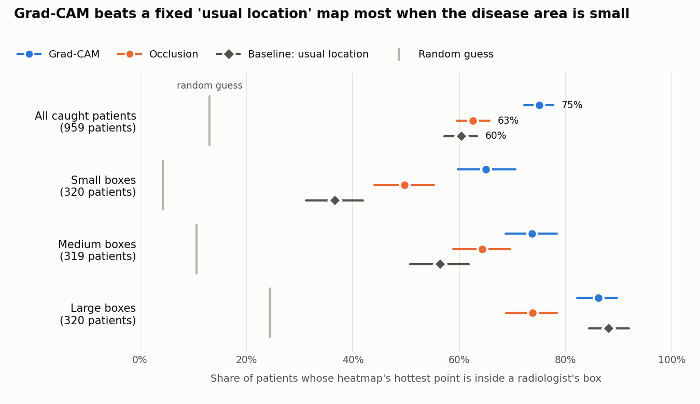
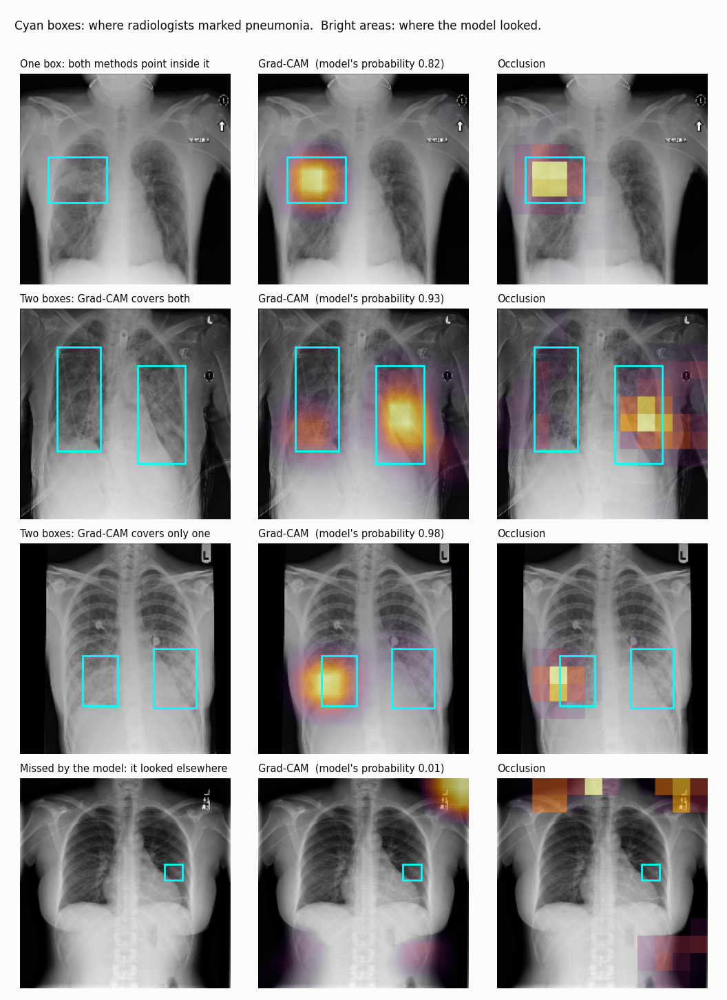

# Do Chest X-Ray AI Explanations Point at the Disease?

An AI model can label a chest X-ray "pneumonia" correctly while looking at the wrong thing, such as a hospital marker in the corner of the image. Heatmap explanations are meant to show where a model looked, but a heatmap is only useful if it is checked against where the disease actually is.

This project trains a pneumonia classifier on 26,684 chest X-rays and tests its explanations against radiologists' markings: when the model says "pneumonia", do its heatmaps fall where radiologists drew their boxes?

**Result:** mostly yes, with important caveats.

- When the model correctly detects pneumonia, the hottest point of its Grad-CAM heatmap falls inside a radiologist's box in **75%** of patients (95% CI 72–78%), against about 13% for a random guess.
- But a fixed map of where pneumonia *usually* appears, which ignores the patient entirely, scores **60%**. The real advantage of the explanation is 15 points, and it disappears when the diseased area is large.
- In 40% of patients with two marked areas, the explanation highlights only one.
- When the model misses pneumonia, its heatmap is somewhere else: inside a box in only 14% of patients, and at the edge of the image in 42%.



## Why this matters

Heatmaps are often shown as evidence that a medical AI model is "looking at the right place". The usual test is whether the heatmap overlaps the disease. This project shows that the test is easy to pass: pneumonia appears in the lungs, so anything that points at the lungs scores well. Without a baseline, a hit rate of 75% says less than it seems to.

## Data

- **Dataset:** [RSNA Pneumonia Detection Challenge](https://www.kaggle.com/competitions/rsna-pneumonia-detection-challenge) (Shih et al., 2019): frontal chest X-rays from the NIH ChestX-ray collection, annotated by radiologists.
- 26,684 patients, one 1024 × 1024 X-ray each. 6,012 patients have pneumonia-like lung opacities, marked with 9,555 boxes.

| Class | Patients | Meaning |
|---|---:|---|
| Lung Opacity | 6,012 | Pneumonia-like opacity, with boxes |
| No Lung Opacity / Not Normal | 11,821 | Another abnormality, not pneumonia |
| Normal | 8,851 | Healthy lungs |

| Split | Patients | With pneumonia | Use |
|---|---:|---:|---|
| Train | 18,678 | 4,208 | Model training |
| Validation | 2,669 | 601 | Choosing the best epoch and the decision threshold |
| Test | 5,337 | 1,203 | All reported results |

Data checks:
- Each patient has exactly one image and one class, so **no patient appears in more than one split**. The split is stratified by class (seed 42).
- All images are 1024 × 1024, 8-bit, with the same greyscale convention. All 9,555 boxes lie inside their images.
- Five patients have recorded ages above 100 (up to 155). These are data-entry errors; the images were kept and the ages excluded from the age analysis.
- **A shortcut exists in the data.** Pneumonia is four times more common in bedside (AP) X-rays (38.3%) than in standard (PA) X-rays (9.3%), so a model could score well by recognising how the X-ray was taken.

The X-rays are not included in this repository. `data/splits.csv` lists the patient IDs in each split.

## Method

**Classifier.** DenseNet-121 pretrained on ImageNet, with a single output (pneumonia or not), trained on images resized to 384 × 384. AdamW, learning rate 1e-4 with a one-cycle schedule, batch size 32, 6 epochs, mixed precision; small random rotations, shifts, zooms and brightness changes during training. The epoch with the highest validation AUC was kept. Training took 26 minutes on one NVIDIA T4 GPU. The model never sees the boxes.

**Explanations.** For each of the 1,203 test patients with pneumonia:
- **Grad-CAM** (Selvaraju et al., 2017) on the last convolutional feature map (12 × 12, upsampled to 384 × 384).
- **Occlusion** (Zeiler & Fergus, 2014): a 64 × 64 grey square is slid across the image in steps of 32 pixels (121 positions), recording how much the pneumonia probability falls.

**Scores.**
- **Hottest point:** is the heatmap's maximum inside a radiologist's box? (the "pointing game", Zhang et al., 2018)
- **Overlap:** of the heatmap's hottest pixels, as many as the boxes cover, what share lies inside the boxes?

**Baselines.**
- **Random guess:** the share of the image the boxes cover.
- **Usual location:** one fixed map, the average of all radiologist boxes in the *training* set. It is the same for every patient.

**Hiding test.** The radiologists' boxes are painted over with the image's average grey, and the change in the model's probability is compared with painting over a same-sized area placed at random where there is no box.

Confidence intervals are 95% bootstrap intervals over patients (2,000 resamples, seed 42); differences between methods are paired.

## Results

### 1. The classifier

| Test set (5,337 patients) | ROC AUC | 95% CI |
|---|---:|---:|
| Model | **0.884** | 0.874–0.894 |
| Shortcut: X-ray view only | 0.703 | 0.689–0.717 |
| Model, bedside (AP) X-rays only | 0.835 | 0.819–0.851 |
| Model, standard (PA) X-rays only | 0.867 | 0.844–0.888 |
| Model, pneumonia vs Normal | 0.975 | 0.969–0.980 |
| Model, pneumonia vs Not Normal | 0.816 | 0.801–0.831 |

- The model beats the view shortcut by 0.181 (CI 0.167–0.195) and still works within each view, so it is not relying on the shortcut alone. Both within-view scores are below the overall score, however, so **part of the headline 0.884 reflects the difference between views**.
- Separating pneumonia from healthy lungs is nearly solved (0.975). Separating it from other abnormalities is the hard part (0.816).
- At a threshold chosen on the validation set (0.212), sensitivity and specificity are both 0.797 (959 of 1,203 pneumonia patients detected). About 96% of the 838 false alarms are patients with another abnormality: 34.1% of that group is flagged, against only 1.8% of healthy patients.
- PR AUC is 0.714 (CI 0.689–0.742), against a pneumonia rate of 22.5%.
- **The probabilities are overconfident.** Brier score 0.111 (0.175 for always predicting the average rate), but in the highest tenth of predictions the model says 92% and the true rate is 83%.
- No difference by sex (0.884 for both). Accuracy falls with age: 0.909 under 40, 0.879 for 40–59, 0.845 for 60 and over.

Training progress:

| Epoch | Train loss | Validation loss | Validation AUC |
|---:|---:|---:|---:|
| 1 | 0.429 | 0.376 | 0.870 |
| 2 | 0.355 | 0.351 | 0.885 |
| 3 | 0.334 | 0.334 | 0.891 |
| 4 | 0.300 | 0.344 | 0.889 |
| 5 | 0.255 | 0.349 | **0.891** |
| 6 | 0.219 | 0.352 | 0.889 |

Validation loss rises after epoch 3 while training loss keeps falling, an early sign of overfitting that is consistent with the overconfident probabilities.

### 2. Do the heatmaps point at the disease?

Patients the model correctly flagged (959):

| Method | Hottest point inside a box | Overlap with boxes |
|---|---:|---:|
| Grad-CAM | **75.0%** (72.1–77.7) | **0.514** (0.499–0.530) |
| Occlusion | 62.6% (59.5–65.7) | 0.394 (0.381–0.408) |
| Baseline: usual location | 60.4% (57.4–63.6) | 0.462 (0.446–0.476) |
| Random guess | 13.1% | 0.131 |

- Grad-CAM beats the fixed map by 14.6 points on the hottest point (CI 10.6–18.1) and by 0.053 on overlap (CI 0.033–0.074).
- Occlusion cannot be separated from the fixed map on the hottest point (+2.2 points, CI −1.8 to 6.3) and is worse on overlap (−0.067, CI −0.086 to −0.047).
- Across all 1,203 pneumonia patients, including those the model missed, Grad-CAM's overlap is no better than the fixed map's (0.429 vs 0.425; difference 0.004, CI −0.015 to 0.023).

### 3. The headline number is inflated by easy cases

Hottest point inside a box, by how much of the image the boxes cover (correctly flagged patients, in thirds):

| Box size | Patients | Grad-CAM | Occlusion | Usual location | Random guess |
|---|---:|---:|---:|---:|---:|
| Small | 320 | 65.0% | 49.7% | 36.6% | 4.3% |
| Medium | 319 | 73.7% | 64.3% | 56.4% | 10.6% |
| Large | 320 | 86.2% | 73.8% | 88.1% | 24.5% |

When the diseased area is large, pointing almost anywhere in the lungs is a hit, and the fixed map matches Grad-CAM. Grad-CAM's advantage is real where the task is hard: with small boxes it scores 65% against 37%.

### 4. The heatmaps do respond to the individual patient

For the 373 correctly flagged patients with a single box, the question is simpler: is the heatmap's hottest point in the same half of the image as the box? A fixed map cannot choose a side.

| Method | Correct side | 95% CI |
|---|---:|---:|
| Grad-CAM | 83.1% | 79.1–86.9 |
| Occlusion | 85.5% | 82.0–89.0 |
| Baseline: usual location | 59.8% | 55.0–64.9 |

Both methods beat the baseline by more than 23 points. Occlusion finds the correct lung as reliably as Grad-CAM; its weaker scores above come from coarser pinpointing, not from looking in the wrong place.

### 5. The explanations are often incomplete

For the 560 correctly flagged patients with two boxes, how many boxes does the heatmap's hottest region reach (at least 10% of the box)?

| Method | Both boxes | Only one | Neither |
|---|---:|---:|---:|
| Grad-CAM | 55.4% | 40.4% | 4.3% |
| Occlusion | 44.6% | 53.0% | 2.3% |
| Baseline: usual location | 92.1% | 6.1% | 1.8% |

In four of ten such patients, Grad-CAM shows one of the two marked areas. The model needs only enough evidence to decide, so its explanation is not a map of all the disease. This is also why the fixed map, which covers both lungs, does well on overlap.



*Cyan boxes: radiologists' markings. Bright areas: where the model looked. The four patients are the first in file order that fit each description, not hand-picked.*

### 6. The model depends on the marked areas, but not only on them

Hiding test, 777 correctly flagged patients:

| | Average pneumonia probability | No longer called pneumonia |
|---|---:|---:|
| Original image | 0.695 | – |
| Radiologists' boxes hidden | 0.371 | 27.2% (24.1–30.4) |
| Same-sized area elsewhere hidden | 0.692 | 1.4% (0.6–2.3) |

Hiding the boxes lowers the probability by 0.323 (CI 0.306–0.341); hiding another area changes it by 0.002 (CI −0.003 to 0.008). The model clearly uses the marked areas. Yet **73% of these patients are still called pneumonia with the marked disease hidden**, so the model also draws on evidence outside the boxes. That fits the view shortcut found in the data.

### 7. When the model misses pneumonia, it is looking elsewhere

| | Detected (959) | Missed (244) |
|---|---:|---:|
| Grad-CAM hottest point inside a box | 75.0% | 13.5% (9.4–18.0) |
| Usual-location baseline | 60.4% | 34.0% (27.9–40.2) |
| Grad-CAM hottest point at the image edge | 3.1% (2.0–4.4) | 42.2% (36.5–48.8) |
| Occlusion hottest point at the image edge | 9.6% (7.8–11.5) | 51.2% (45.1–57.4) |
| Share of the image covered by boxes | 13.1% | 6.5% |
| Patients with two or more boxes | 61.1% | 31.1% |
| Grad-CAM and occlusion agreement | 0.60 | 0.32 |

For missed patients, Grad-CAM does worse than the fixed map (−20.5 points, CI −28.3 to −13.1), and its hottest point is within 10% of the image border about as often as a random point would be (36%). In these cases the heatmap carries no information about where the disease is, and the two methods largely disagree with each other. Missed patients have smaller and fewer marked areas.

## Limitations

- **One model, one training run, one dataset.** Results may differ for other architectures, random seeds or hospitals.
- **Boxes are approximate.** A rectangle is a coarse outline of an opacity, and radiologists can disagree. Disease may extend outside a box.
- **Only pneumonia patients can be scored.** Patients without boxes have nothing to compare a heatmap against, so the model's 838 false alarms are not analysed here.
- **Coarse heatmaps.** Grad-CAM starts from a 12 × 12 map and occlusion uses 64-pixel squares; finer methods might pinpoint better. For ranking pixels, Grad-CAM's final ReLU was omitted, which does not move the maximum when any positive evidence exists.
- **Grey squares are artificial.** Occlusion and the hiding test show the model images unlike any it was trained on, which can itself change its output. The control area accounts for part of this, but control positions are random and may fall outside the lungs.
- **The hiding test excludes 182 patients** whose boxes were too large to leave room for a control area, so it under-represents extensive disease.
- **The 10% rule** for counting a box as "reached" is a chosen threshold.
- **Images were reduced** from 1024 × 1024 to 384 × 384.
- **Agreement with radiologists is not proof of sound reasoning.** A heatmap inside a box shows where the model's evidence is, not that it is using it as a clinician would.
- **Not for clinical use.** The model is overconfident and has not been validated in any clinical setting.

## Future work

- Repeat with several random seeds and a second architecture
- Calibrate the probabilities (for example with temperature scaling)
- Train with the X-ray view balanced or controlled, and check whether reliance on evidence outside the boxes falls
- Examine where the model looks in its false alarms
- Test on an external dataset from another hospital

## Repository structure

```text
.
├── data/
│   └── splits.csv                  # patient IDs and their split (no images)
├── notebooks/
│   ├── xray-01-data-check.ipynb    # data checks, patient split, image resizing
│   ├── xray-02-train.ipynb         # DenseNet-121 training and test predictions (GPU)
│   ├── xray-03-evaluate.ipynb      # accuracy, view shortcut, calibration, patient groups
│   ├── xray-04-heatmaps.ipynb      # Grad-CAM, occlusion, baselines, hiding test (GPU)
│   └── xray-05-analysis.ipynb      # confidence intervals, deeper checks, figures
├── results/
│   ├── training_log.json
│   ├── classifier_metrics.csv
│   ├── calibration_table.csv
│   ├── localization_results.csv    # per-patient heatmap scores
│   ├── localization_summary.csv
│   ├── side_test.csv
│   ├── two_box_coverage.csv
│   ├── hiding_test.csv
│   ├── edge_test.csv
│   ├── hit_rate_by_box_size.csv
│   ├── hit_rate_by_box_size.png
│   └── examples_grid.png
└── README.md
```

## Reproducing

1. The notebooks were run on Kaggle, in order. Notebooks 02 and 04 need a GPU (a free T4 is enough); the others do not.
2. Join the [RSNA Pneumonia Detection Challenge](https://www.kaggle.com/competitions/rsna-pneumonia-detection-challenge) on Kaggle to access the data, and add it as an input to notebooks 01 and 04.
3. Each notebook reads the saved output of the earlier ones, added through Kaggle's "Add Input".

## References

- Shih, G. et al. (2019). Augmenting the National Institutes of Health Chest Radiograph Dataset with Expert Annotations of Possible Pneumonia. *Radiology: Artificial Intelligence*, 1(1).
- Selvaraju, R. R. et al. (2017). Grad-CAM: Visual Explanations from Deep Networks via Gradient-based Localization. *ICCV*.
- Zeiler, M. D. & Fergus, R. (2014). Visualizing and Understanding Convolutional Networks. *ECCV*.
- Zhang, J. et al. (2018). Top-Down Neural Attention by Excitation Backprop. *International Journal of Computer Vision*, 126.
- Saporta, A. et al. (2022). Benchmarking saliency methods for chest X-ray interpretation. *Nature Machine Intelligence*, 4.
- Zech, J. R. et al. (2018). Variable generalization performance of a deep learning model to detect pneumonia in chest radiographs. *PLOS Medicine*, 15(11).

## Author

Chinecherem Divine Mbah · [GitHub](https://github.com/Chichay317)
